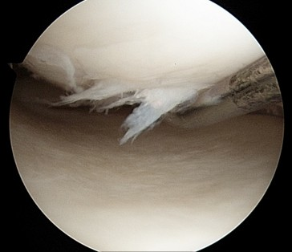

# 🏥 Algovera: Medical image classification for arthroscopic surgery images

The aim of the project is to develop a proof of concept of a medical image classification algorithm. Algovera has been working with [nCight](https://www.ncight.com/) to create a small labelled dataset of about 100 images of knee and shoulder surgeries. This dataset has been uploaded to the Ocean [marketplace](https://market.oceanprotocol.com/). In this case, the surgical images contain personal data, and a private dataset is used so that data scientists cannot directly download or view the majority of images (except for a small number of sample images). Instead, data scientists will need to write algorithms that travel over the network to the location of the data itself (called compute-to-data, C2D). The outputs, such as statistical results and trained machine learning models, are then returned to the data scientist. For more information, check out our blog [post](https://docs.algovera.ai/blog/2022/01/24/Announcing%20Algovera%E2%80%99s%20Partnership%20with%20nCight%20to%20develop%20a%20medical%20image%20classification%20algorithm).

<p align="center">
    
</p>

# Contents

- [👪 Community](#-community)
- [🏗 Initial Setup](#-initial-setup)
- [🏛 License](#-license)

# 👪 Community

## Algovera

The mission of Algovera is to empower data scientists to work independently outside of centralised tech companies. We think this is preferable to the current status quo for two main reasons. Firstly, it gives data scientists more freedom to work on projects that really interest them and inspire their passion. We believe this will result in more individuals working on projects that are good for society. Imagine a world where the brightest minds worked to develop AI for healthcare, climate, privacy and democratised finance, rather than surveillance, ad clicks and attention engineering. Secondly, it means that data scientists can own what they create. We believe that ownership and the passive income generated by co-owned inventions and IP can help to further cement the security of the independent data scientist in the long term.

[Website](https://www.algovera.ai/) | [Notion](https://algovera.notion.site/) | [Discord](https://discord.gg/e65RuHSDS5) | [Calendar](https://algovera.notion.site/Calendar-9d79fab364234b47b6d24021efc28e42) | [Twitter](https://twitter.com/AlgoveraAI) | [YouTube](https://www.youtube.com/channel/UC2A5iUpP6k52ZZmC8LFj1IA) 

## nCight

nCight are building a network of independent orthopaedic surgeons, and empowering them by unlocking arthroscopic imaging data for sale to medical device companies. Independent physicians struggle with maintaining autonomy due to the negative reimbursement pressures from third party payors. For the first time in the history of the United States, the number of employed physicians outnumber independent physicians. Orthopaedic surgeons have been able to withstand consolidating pressures largely due to access to ancillary streams of revenue such as ambulatory surgery centres and owning PT and advanced imaging (e.g. MRI). Even with these additional streams of income the number of surgeons in private practice has declined by over 30% over the last 20 years. Independent physicians drive innovation and represent an important part of the healthcare system. It was independent surgeons that pioneered advances in pain management and anaesthesia to make outpatient procedures safe and cost effective, saving the healthcare system 100s of millions of dollars. There is therefore a public interest in keeping physicians independent. It is easy to see that the goals of Algovera and nCight are well aligned.

# 🏗 Initial Setup 

## Set up environment

Open a new terminal and:
```console
#clone repo
git clone https://github.com/AlgoveraAI/freelance-medical-image-classification.git
cd freelance-medical-image-classification
```

# 🏛 License

The license is MIT. [Details](LICENSE)
